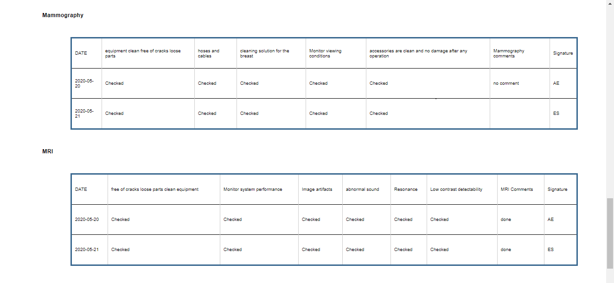

# Clinical Final Project

## Team: 18

## Submitted By:  

Alzahraa Eid Abd El-Fattah

Alzahraa Mahmoud

Amany Bahaa El-Din Mustafa

Esraa Sayed Mustafa

Mustafa Tawfik

-------------

## Pre-Requistics:

1) Create data base with name ***clinicaldatabase***.
2) In data base import file ***clinicaldatabase.sql***.
3) Run file ***server.py***

---------------

# Server Flow

1) Home page:

2) When we choose **Radiology** :

the department's page appear with:

1. The department's devices with their serial numbers

2. Three buttons|:

   1. When we click on **View Devices' Details** , department's devices' details are reviewed

2. When we click on **Daily Inspection reporting**, we can add a new daily inspection report for all department's devices

   first, you need to insert date of the day
   then, check each point for each device and write your comment

   

 

   after finishing inspection report for all devices, you need to add a signature and click submit to save the results at the data base

3. When we click on **View Department's Daily inspection Report**, a review report for all devices in the department appears

while , if you need a report for one device only, you need to enter its serial number in the input box, 

for an example, if you need to get the report for **Mammography** device , you have to enter its serial number.

to get its report

#### Comments:

We have faced problems during searching for daily inspection for specific devices (Dye Injector , Diagnostic X-Ray , FCR),
so we couldn't do a report for them, and an error page appears if their serial number is entered.
for an example, if FCR serial number is entered, this page appears:

3) When we choose **Open Heart**: